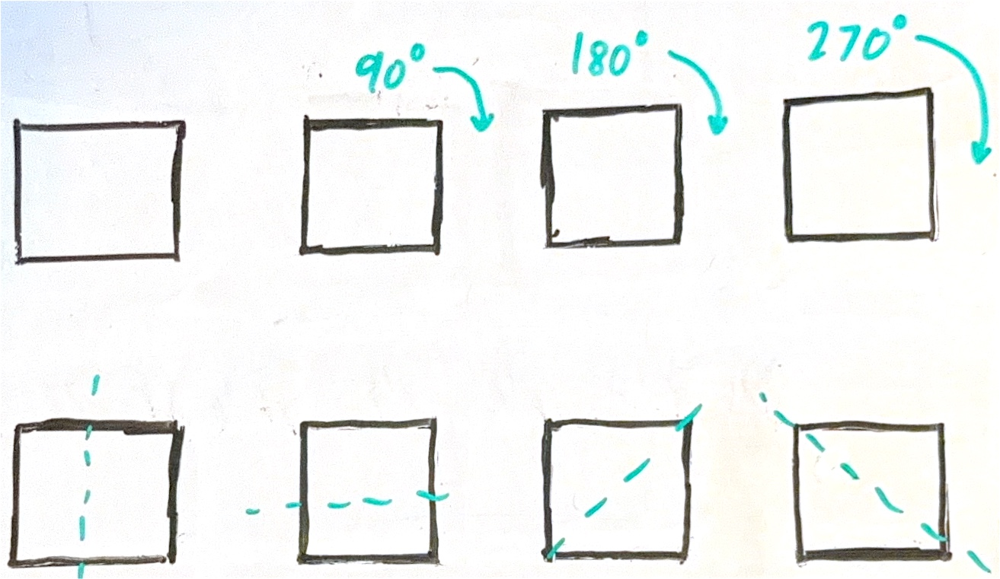

## What even is group theory?

:blue[Group theory], broadly speaking, is the study of *symmetries*. For example, think of all the different ways you can flip and rotate a square and still have it look the same. You can :green[rotate] it :red[90], :red[180], or :red[270] degrees clockwise, or you can :green[flip] it across the :red[vertical], :red[horizontal], or the two :red[diagonal] axes. We also include the act of doing nothing, which obviously keeps the square the same. (You'll learn why later on.)

*Figure 1. Rotational and reflectional symmetries of a square.*

## Why would I learn this stuff?

Although studying symmetries might sound like a very niche topic, :blue[group theory] appears in so many other parts of math like linear algebra and calculus. It's even been used to prove and build things in other non-mathematics fields too! For example:

- In chemistry, groups are used to study [molecular symmetry](https://en.wikipedia.org/wiki/Molecular_symmetry), a fundamental concept for classifying and categorizing certain molecular behaviors.
- In physics, [Emmy Noether](https://en.wikipedia.org/wiki/Emmy_Noether) used group theory to prove that [every conservation law corresponds to a certain symmetry](https://en.wikipedia.org/wiki/Noether%27s_theorem).
- In cryptography, groups are used to implement some of the newest forms of public-key encryption known as [ellpitic-curve cryptography](https://en.wikipedia.org/wiki/Elliptic-curve_cryptography). If you've ever used an `ed25519` key, that's [EdDSA](https://en.wikipedia.org/wiki/EdDSA#Ed25519), and it's a type of elliptic-curve cryptography!

Aside from real-world applications, I personally think groups are interesting in their own right. Groups are tools that can represent so many different things, such as

- [a Rubik's Cube and all its different turns](https://en.wikipedia.org/wiki/Rubik%27s_Cube_group),
- the [symmetries of certain wallpaper patterns](https://en.wikipedia.org/wiki/Wallpaper_group), or even
- [musical intervals, notes, rhythms, or other objects, and transformations between them](https://en.wikipedia.org/wiki/Transformational_theory) (though, this one's quite playful more than anything).

By studying group theory, we can gain insight into all these seemingly unrelated things and gain a sense for how they truly work. This sounds abstract, but my hope is that you'll be able to appreciate abstract algebra a bit more at the end of all this!

---

## So, what is a group?

